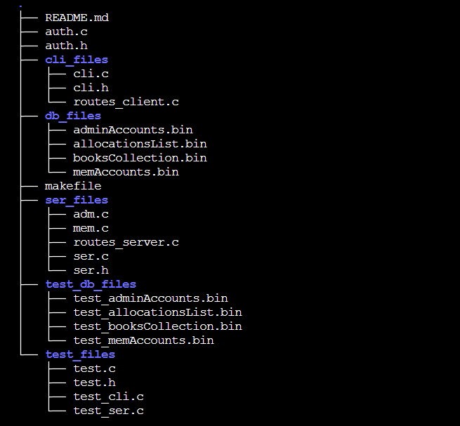

# LMS - Library Management System

LMS is a mini project made as a part of the Software Engineering Lab Course.

## Context

The project assumes that the library is huge, with ample books, members, and administrators. The members can self-register to become authorized members of the library. They choose the books and approach the administrators to authorize the issue. In a large library, administrators might sometimes be unable to interact as fluently as they would face-to-face. Hence, mutual exclusion is required to prevent collisions in "transactions" (in a rough sense only). The administrators can add books, authorize issues, and revoke them, while members can view their issued books, due dates, and books available in the library at their convenience. For the current case, even admin can self-register, but an additional authorization can be put in place, as the case may be. Numerous queries for the admin can be explored. A few have been implemented here as described by the menu.

## Salient Features

- It utilizes a concurrent server to handle multiple clients that connect to it.
- File locking is implemented using fcntl to ensure mutual exclusion and protect critical sections, thus ensuring concurrency control.
- User Authentication: Members are required to pass through a login system to access their accounts, ensuring data privacy and security.
- Dedicated unit testing constructs.

## Structure



- **ser_files**, **cli_files** and **test_files** contain respective codes for the server, client and test functionalities.
- **db_files** contain binary files for data storage.


## How to run?

1. Clone the repository. Make file contains all the make routes.
2. Run the following command to make server and client executables: 
```
make all
```
3. After step 2, one can see 2 executable files: "client" and "server". Run the following command to start the server: 
```
./server
```
4. On different terminals (since for testing purposes the client and server will be on the same machine), run the following command to start the client (NOTE: member and admin are both clients. Server refers to more of query processing stop)  
```
./client
```
5. To remove the executables, run the following command: 
```
make clean
```

## Testing
We use CUNIT to help with our tetsing phase.
1. Simply run 
```
make test
``` 
This creates an executable ```test``` that tests some functions common to both server and client.

2. **/test_db_files** are created separate from the working **db_files**. A user and an admin is pre added to these files to facilitate tetsing. To test the server and client functionlaities in isolation, we need a mechanism to mock the *send()* and *recv()* functionalities.
- In the **ser_files/adm.c** and **ser_files/mem.c**, there is a macro at top **TESTING_MODE** that must be set to **1** in order for the *send()* and *recv()* functions to get mocked. Their behaviour is imitated by a pair of pipes facilitating exchange of messages between server and client(not an actual connection, but a simulation).
- In the makefile, see the rule for make 'test'. Uncommenting **\$(TARGET_TEST_SERVER)** and **$(TARGET_TEST_CLIENT)** and then running ```make test``` will create corresponding test executables: ```test_server```and ```test_client```.
3. These executables test the fucntions of server and client respectively.
4. For the sake of demonstration we test 2 functions that perform CRUD operations on the server's part. This can be extended easily to all fucntions.
5. To delete all test executables
```
make cleant
``` 
